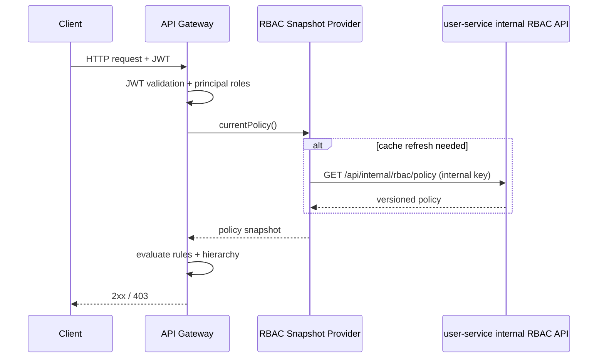
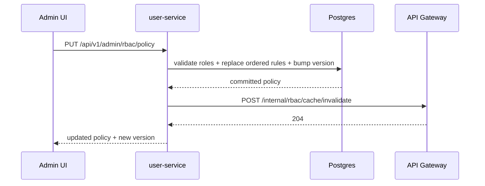

# RBAC Framework High Level Design (HLD)

Date: 2026-03-20  
Scope: ElectraHub platform gateway-centric authorization with centralized policy management.

## 1. Purpose
Design a production RBAC framework that:
- Enforces authorization consistently at the API Gateway.
- Centralizes policy definition and versioning in user-service.
- Allows controlled live updates through admin APIs/UI.
- Minimizes downtime and stale-permission windows.

## 2. Business Goals
- Single authorization enforcement point for all platform APIs.
- Centralized, auditable policy source of truth.
- Fast policy propagation with safe fallback behavior.
- Support incremental rollout:
1. Gateway RBAC engine with static/file policy.
2. DB-backed policy in user-service + gateway cache invalidation.
3. Admin UI for role-permission policy operations.

## 3. Non-Goals
- Fine-grained ABAC decisions based on dynamic resource attributes.
- Per-tenant policy isolation (current model is global policy key).
- Runtime role creation workflow beyond existing role catalog.

## 4. Architecture Overview
The RBAC framework is split into a data plane and control plane.

- Data plane: API Gateway request authorization.
- Control plane: user-service policy management and distribution.
- Operations plane: admin-portal UI for policy edits.

```mermaid
flowchart LR
    U["Client Apps"] --> G["API Gateway"]
    G --> S1["Auth Service"]
    G --> S2["User Service"]
    G --> S3["Payment/Subscription/Charger Services"]

    A["Admin Portal UI"] -->|GET/PUT policy| USA["User-Service Admin RBAC API"]
    USA --> DB["user_mgmt Postgres (rbac_policies, rbac_policy_rules)"]
    USA -->|invalidate| GIC["Gateway Internal RBAC Cache API"]

    G -->|pull policy (internal key)| USI["User-Service Internal RBAC API"]
    USI --> DB
```

## 5. Core Components

### 5.1 API Gateway (Policy Enforcement Point)
- Validates JWT and builds authenticated principal.
- Evaluates request against compiled RBAC policy.
- Supports role hierarchy expansion (for inherited permissions).
- Denies by default when no rule matches unless policy default is ALLOW.
- Pulls RBAC policy from user-service and caches it in-memory.

### 5.2 user-service (Policy Administration Point + Policy Decision Source)
- Stores policy and ordered rules in Postgres.
- Exposes admin APIs to read/update policy.
- Exposes internal API for gateway policy fetch.
- Validates required roles against existing role catalog.
- Triggers gateway cache invalidation after successful policy update.

### 5.3 Admin Portal (Phase 3 UI)
- Provides RBAC policy editor:
  - Role hierarchy.
  - Default decision.
  - Ordered rule list (methods, path pattern, effect, anonymous, required roles).
- Persists through user-service admin endpoint.
- Displays policy version and available roles.

## 6. Policy and Decision Model

### 6.1 Policy Shape
- Policy key (`gateway-default`).
- Role hierarchy string (`ROLE_SYSTEM_ADMIN > ROLE_USER`).
- Default decision (`ALLOW` or `DENY`).
- Ordered rules:
  - methods (`*` or explicit verbs)
  - path pattern (Ant-style)
  - effect (`ALLOW`/`DENY`)
  - allowAnonymous (boolean)
  - requiredRoles (list)

### 6.2 Decision Semantics
- Rules are evaluated in order.
- If a matching `DENY` rule is found, request is denied immediately.
- For matching `ALLOW` rules:
  - Allowed if anonymous and `allowAnonymous=true`.
  - Otherwise authentication required.
  - If `requiredRoles` empty, allow authenticated.
  - Else allow when any required role matches effective hierarchical roles.
- If no rules match:
  - Use `defaultDecision`.

## 7. Runtime Flows

### 7.1 Authorization Flow (Data Plane)


### 7.2 Policy Update Flow (Control Plane)


## 8. Security Model
- Gateway remains the enforcement boundary for external API access.
- user-service admin policy APIs require `SYSTEM_ADMIN`.
- Internal RBAC APIs use `X-Internal-Api-Key`.
- Anonymous access is explicitly modeled per rule (`allowAnonymous`).
- Default-deny posture is supported and recommended.

## 9. Availability and Resilience
- Gateway uses cached policy snapshot to avoid per-request policy RPC.
- Scheduled + on-demand refresh for eventual consistency.
- If remote policy fetch fails, gateway keeps cached/fallback policy.
- Invalidation endpoint forces near-real-time propagation post-update.

## 10. Scalability Considerations
- Authorization evaluation is in-process and O(number of rules).
- Policy fetch is amortized by refresh interval and invalidation.
- No per-request DB reads on authorization path.

## 11. Observability
- Gateway emits RBAC decision debug logs (method/path/principal/rule outcome).
- Policy refresh success/failure logs around remote fetch.
- user-service logs cache invalidation failures without breaking policy write path.
- Version field supports policy rollout traceability.

## 12. Phase Mapping
- Phase 1: Implemented design foundation in gateway (engine + rule model).
- Phase 2: Implemented DB-backed policy source, internal fetch API, invalidation.
- Phase 3: Implemented policy management UI in admin portal.

## 13. Key Risks and Mitigations
- Risk: stale permissions after policy changes.
  - Mitigation: explicit invalidation + periodic refresh + versioning.
- Risk: broad wildcard rules unintentionally over-permit.
  - Mitigation: ordered explicit `DENY` support, admin review workflow.
- Risk: invalid role references in policy.
  - Mitigation: server-side validation against role catalog on update.
- Risk: internal key leakage.
  - Mitigation: secret management/rotation and internal-network restriction.

